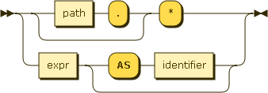
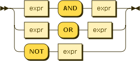
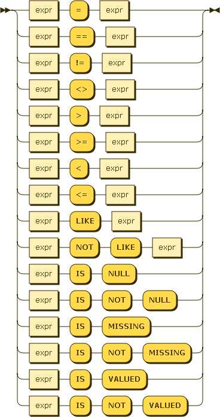
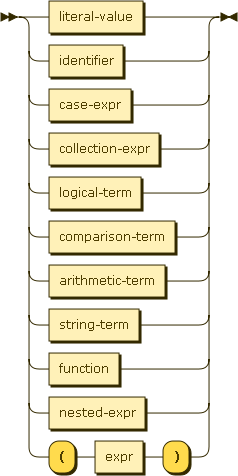
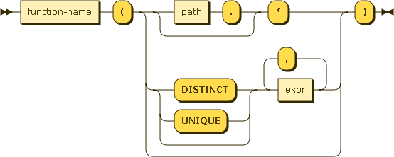
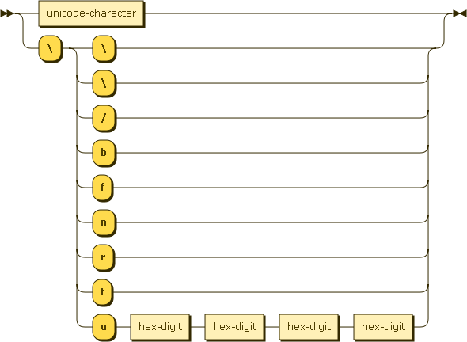
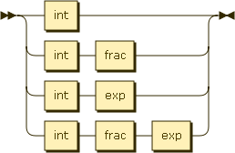
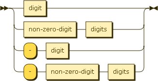
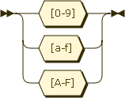

# Unstructured Query Language 2013 (UNQL 2013)

* Status: DRAFT/PROPOSAL
* Latest: [unql-2013](https://github.com/couchbaselabs/tuqqedin/blob/master/docs/unql-2013.md)

## Summary

Unstructured Query Language 2013 (UNQL 2013) is a query language for Couchbase Server.

This language attempts to satisfy these [requirements](https://github.com/couchbaselabs/tuqqedin/blob/master/docs/requirements.md).

This document describes the syntax and semantics of the language.

## Statement

An UNQL statement is an instance of:

unql-stmt:

### EXPLAIN

An UNQL statement can be preceded with the keyword "EXPLAIN".  This causes the statement to return information about how the UNQL statement would have operated if the EXPLAIN keyword had been omitted.

The output from EXPLAIN is intended for analysis and troublehsooting only.  The details of the output format are subject to change.

### SELECT Core

Before looking at the full SELECT statement, let us start with a simpler subset:

select-core:

result-expr:

The SELECT statement is used to query the bucket.  The result of a SELECT is an array containing zero or more result objects.

#### Select Procesing

The behavior of a SELECT query is best understood as a sequence of steps.  Output objects from a step become input objects to the next step.

1.  Filtering - result objects are filtered by the WHERE clause 
2.  Result Object Generation - result objects are generated from GROUP BY, and HAVING clauses and the result-field expression
5.  Duplicate removal - if this is a DISTINCT query, duplicate result objects are removed

##### Filtering

If a WHERE clause is specified, the expression is evaluated for each object.  All objects evluating to TRUE are included in the result array.

##### Result Object Generation

Result object generation depends on whether or not this is an aggregate query.  An aggregate query is any query which either contains a GROUP BY clause or references one or more aggregate functions in the result-field expressions.

* Non-aggregate query - the result-field expression is evaluated once for each object.
* Aggregate query without GROUP BY - the result-field expression is evaluated once for a single group containing all objects.
* Aggregate query with GROUP BY - each expression the GROUP BY clause is evaluated once for each row.  Based on this evaluation each row is assigned to a group.  If a HAVING clause was also specified, it is evaluated once for each group.  If the result of evaluation is false this group is discarded.  Finally, the result-field expression is evaluated once for each group.

##### Duplicate Removal

If the ALL keyword was specified all result objects are retuned by the result array.  If the DISTINCT keyword was specified duplicate result objects are removed from the result array.  If neither ALL/DISTINCT keyword was specified, the statement behaves as if the ALL keyword had been specified.

### SELECT Statement

Now, we can expect to consider the full SELECT statement:

select-stmt:

ordering-term:

#### ORDER BY and LIMIT/OFFSET

If no ORDER BY clause is specified, the order in which the result objects are returned is undefined.

If an ORDER BY clause is specified, the order of items in the result array is determined by these expressions.  Objects are first sorted by the left-most expression in the list.  Any items with the same sort value are then sorted by the next expresion in the list.  This is repeated to break tie sort values until the end of the expression list is reached.  The order of objects with the same sort value for each sort expression is undefined.

As ORDER BY expressions can evaluate to any JSON value, it must define an ordering when comparing values of different types.  The following list describes the order by type (from lowest to highest):

* missing value
* null
* false
* true
* number
* string
* array (element by element comparison, longer arrays sort after)
* object (key/value by key/value comparison, larger objects sort after)

The LIMIT clause imposes an upper bound on the number of objects returned by the SELECT statement.  The LIMIT clause must be an integer.

An OFFSET clause can optionally follow a LIMIT clause.  When specified, this many rows are omitted from the result prior to enforcing the specified LIMIT.  The OFFSET clause must be an integer.

### Expressions

Expressions are divided into two types, Boolean Expressions and Expressions.  Boolean Expressions always evaluate to a boolean value.  Expressions can evaluate to any valid JSON.  All Boolean Expressions are also Expressions.

#### Boolean Expression

boolean-expr:

There are four types of Boolean Expressions, logical terms, comparison terms, element matches, and boolean functions.  Boolean Expressions can also be grouped using parentheses.

logical-term:

Logical terms allow for combining other boolean expressions using boolean logic.  Standard AND, OR and NOT operators are supported.

comparison-term:

Comparison terms allow for comparing two expressions.  Standard "equal", "not equal", "greater than", "greater than or equal", "less than", and "less than or equal" are supported.

For equal (= and ==) and not equal (!= and <>) two forms are supported to aid in compatibility with other query languages.

In UNQL a comparison operator implicitly requires that both operands be of the same type.  If the operands are of different types it always evaluates to FALSE.

The LIKE operator allows for wildcard matching of string values.  The right-hand side of the operator is a pattern, optionally containg '*' and '?' wildcard characters.

The IS NULL operator returns rows where the value of a property is explicitly set to NULL (not missing).

The IS NOT NULL operator returns rows which contain a value (not NULL or missing).

For more precise control finding NULL or missing values see the MISSING() function.

element-match:

The Element Match operator allows you to determine if an array contains objects satisfying a Boolean Expression.  If the expression on the left hand side of the operator is not an array it will evaluate to FALSE.

An optional modifier ANY or ALL can be included.  If the modifier is not specified, the default behavior is ANY.

* ANY - if any object in the array satisfies the Boolean Expression, the result is TRUE, otherwise FALSE
* ALL - if all objects in the array satisfy the Boolean Expression, the result is TRUE, otherwise FALSE

boolean-function:

Boolean functions are functions which already return a boolean value.

boolean-function-name:

Currently there is only one boolean function defined.

MISSING(property-path, include-nulls)

The first argument *property-path* is the property path to check to see if it is missing.
The second argument *include-nulls* is a boolean that determines whether or not to consider null values as missing.  TRUE considers null values missing, FALSE does not.

#### Expression

expr:

property-path:

A property path is a description of a field in a JSON object using standard dotted notation and integer array indexes.  Consider the following object:

    {
      "name": "unql",
      "address": {
      	"city": "Mountain View"
      },
      "revisions": [2013]
    }

 The path `name` evaluates to the value `"unql"`.

 The path `address.city` evalutes to the value `"Mountain View"`.

 The path `revisions[0]` evaluates to the value `2013`.

arithmetic-term:

Arithemetic terms allow for performing basic arithmetic within an expression.  The standard addition, subtraction, multiplication, division, and modulo operators are supported.  Additionally, a negation operator will change the sign of the expression.

These arithmetic operators only operate on numeric values.  If either operatnd is not numeric it will evaluate to NULL.

function:

There are two types of functions, aggregate functions and core functions.

function-name:

aggregate-function-name:

There are 5 aggregate functions, SUM, AVG, COUNT, MIN, and MAX.  Aggregate functions can only be used in SELECT, HAVING, and ORDER BY clauses.  When aggregate functions are used in expressions in these clauses, the query will operate as an aggregate query.  Aggregate functions take one argument, the value over which to compute the aggregate function.  The COUNT function can also take '*' as its argument.

##### Null/Missing/Non-numeric Elimination

If the argument the aggregate function is '*' all rows are considered.
If the argument to the aggregate function is anything else, then if the result of evaluating the expression is Null or Missing, that row is eliminated.

For, AVG, SUM, MIN, and MAX, any row where the result of the expression is non-numieric is also eliminated.

core-function-name:

Currently there is only one core function defined.

LENGTH(expr)

Returns the length of the value after evaluting the expression.  The exact meaning of length depends on the type of the value:

* string - the length of the string
* array - the number of items in the array
* object - the number of key/value pairs in the object
* anything else - null

## Appendix 1 - Literal JSON Values

The following rules are the same as defined by [json.org](http://json.org/) with two changes:

1.  In standard JSON arrays and objects only contain nested values.  In UNQL, literal arrays and objects can contain nested expressions.
2.  In standard JSON "true", "false" and "null" are case-sensitive.  In UNQL, to be consistent with other keywords, they are defined to be case-insensitive.

literal-value:

object:

members:

pair:

array:

elements:

string:

chars:

char:

number:

int:

frac:

exp:

digits:

non-zero-digit:

digit:

e:

hex-digit:

## Appendix 2 - Key/Reserved Words

The following keywords are reserved and cannot be used in document property paths.  All keywords are case-insensitive.

* ALL
* AND
* ANY
* AS
* ASC
* BY
* DESC
* DISTINCT
* EXPLAIN
* FALSE
* FROM
* GROUP
* HAVING
* IS
* LIKE
* LIMIT
* MISSING
* NOT
* NULL
* OFFSET
* OR
* ORDER
* SELECT
* TRUE
* WHERE

## About this Document

The [grammar](https://github.com/couchbaselabs/tuqqedin/blob/master/docs/unql-2013.ebnf) forming the basis of this document is written in a [W3C dialect of EBNF](http://www.w3.org/TR/REC-xml/#sec-notation).

This grammar has not yet been converted to an actual implementation, ambiguities and conflicts may still be present.

Diagrams were generated by [Railroad Diagram Generator](http://railroad.my28msec.com/) 